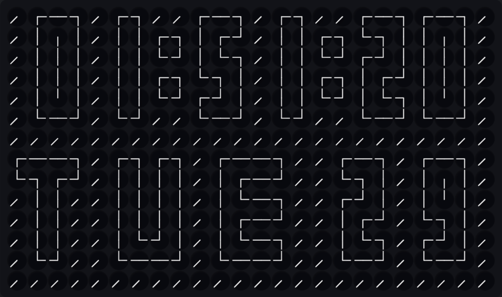

# Million Times Clock

A generative clock art piece: a grid of hundreds of tiny analog clocks, each one
individually posed so that together they spell out the current time.



Watch Demo here [Demo](http://hammad-infinity.github.io/Million-Times-Clock/)
Built with nothing but HTML, CSS, and vanilla JavaScript — no build step, no
dependencies, no framework.

---

## What it does

Every cell in the grid is a real two-hand clock. The hands rotate to preset
angles so that a cell can represent a "pixel" of a larger glyph. By arranging
those glyphs across the grid, the display can spell digits, letters, the
current time, and a rotating set of 22 animated patterns.

- **Time mode** — shows HH:MM (and seconds when the grid is large enough), plus
  a day/date strip underneath.
- **Portrait mode** — when the grid is taller than it is wide, hours and minutes
  stack vertically for larger digits.
- **Scroll mode** — a random stream of letters that scrolls across the grid.
- **20 procedural patterns** — radial vectors, vortex fields, spirals, rings,
  pinwheel, burst, figure-8, crosshatch, and more, all animated smoothly.

---

## Features

| Feature | Notes |
|---|---|
| Adjustable grid | 8–24 columns, 3–14 rows, live preview |
| Auto-fit | Cell size scales to the largest grid that fits the window |
| 12 / 24-hour | Toggle at runtime |
| Dark / Light theme | Smoothly interpolated color transitions |
| Mouse follow | Every hand tracks the cursor with easing |
| Ripple click | Clicking the canvas sends an angle ripple outward |
| Transition speed | 1–20 s slider for pattern-to-pattern animation |
| Fullscreen | Press **F** to toggle (not listed in the UI) |
| Draggable HUD | Settings button snaps to the nearest left/right edge |
| Persistent | Theme and grid size are remembered in `localStorage` |

---

## How it works

### Cells are clocks

Each cell is drawn as a small clock face with two hands:

- **Hand A** — long (`0.95 × radius`)
- **Hand B** — short (`0.85 × radius`)

Angles are in degrees, where `0 = up`, `90 = right`, `180 = down`, `270 = left`
(clockwise because canvas rotation is clockwise).

### Glyphs are pose grids

A glyph is a 2-D array of *state indices* into a shared pose table
(`clockStates`). Index `12` is the "blank" pose `(225°, 225°)`, used to clear a
cell. Converting a glyph to angles is a single table lookup.

- **Digit sets**: `2x3, 2x4, 2x5, 3x4, 3x5, 3x6` (width × height). Each is a
  set of ten grids, one per digit.
- **Letters**: fixed 4 × 6 grids, A–Z.
- **Overrides**: `handEdits` re-styles specific glyphs by supplying exact
  `[angleA, angleB]` pairs (used to fix R, M, W, Q, X, Z, A, B, G, K, N, V, Y).

### Layout search picks the scale

`searchTimeLayout` brute-forces every combination of glyph set, format
(`hms`, `hm`, plain variants), colon width, and inter-digit gap that fits the
grid. Candidates are ranked lexicographically:

1. colons present → 3-wide digits → hms over hm → wider colon → taller glyph → gap

`chooseTimeLayout` adds a portrait check first: if `rows > cols`, it looks for
the largest glyph set that can stack hours over minutes with one blank row
between them.

### Animation is per-cell

The `Clock` class holds `angleA/B`, `animA/B`, and `alphaA/B`. When a target is
set:

- Rotation always takes the **shortest angular path**.
- Alpha fades use `smoothStep`, rotation uses linear interpolation.
- A `null` target fades the hand out and parks it at the rest angle.

Resizing the grid preserves existing `Clock` instances, so hands keep their
current angles across column/row changes.

### Rendering

The clock face is a radial gradient rendered **once** into an offscreen canvas
and blitted per cell. Hands and hubs are drawn on top. Ripples are additive
angle offsets applied at draw time.

---

## Getting started

No build step. Just open `index.html` in a browser.

```bash
git clone https://github.com/Hammad-Infinity/Million-Times-Clock.git
cd Million-Times-Clock
open index.html   # macOS
# or: xdg-open index.html   # Linux
# or: start index.html      # Windows
```

Or serve it locally if you prefer:

```bash
python3 -m http.server 8000
# then visit http://localhost:8000/index.html
```

---

## Controls

| Control | Where | Effect |
|---|---|---|
| Theme pill | Settings header | Dark / Light |
| Columns slider | Settings | Grid width (8–24) |
| Rows slider | Settings | Grid height (3–14) |
| Speed slider | Settings | Pattern transition duration (1–20 s) |
| Show time | Settings | Jump to the live clock |
| 24-hour | Settings | Toggle 12/24-hour display |
| Mouse follow | Settings | Hands track the cursor |
| **F** key | Anywhere | Toggle fullscreen |
| Click canvas | Anywhere | Spawn a ripple from that cell |
| Drag the HUD | Settings button | Snap panel to left or right edge |

---

## Browser support

Requires a modern evergreen browser with:

- Canvas 2D (`globalCompositeOperation`, `createRadialGradient`)
- Pointer Events
- Fullscreen API (for the **F** shortcut)
- `localStorage` (for persistence; degrades gracefully)

Tested on current Chrome, Firefox, Safari, and Edge.

---

## Project structure

```
index.html   Single-file app: styles, markup, and script
README.md                  This file
docs/                      Screenshots and demo media (see below)
```

The app is intentionally a single file. Everything else is documentation.

---

## License

- The GNU Affero General Public License (AGPL).
